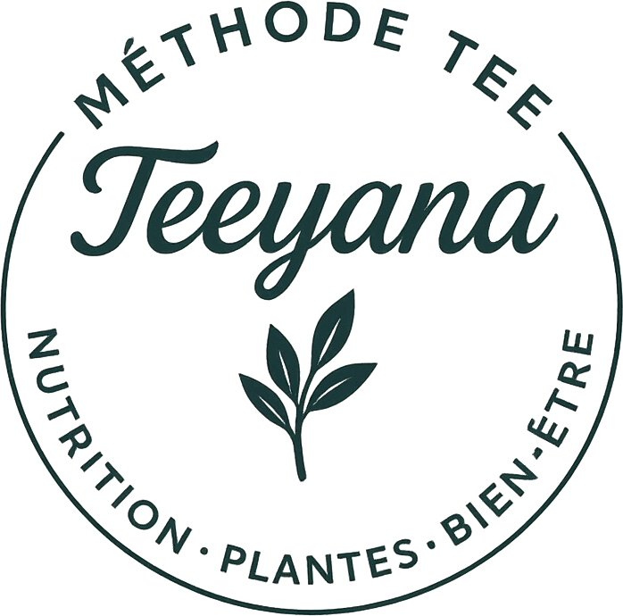

## dashboard.html
--- 441/dashboard.html

+++ V4874/dashboard.html

@@ -7,5 +7,4 @@

 <link rel="apple-touch-icon" href="assets/app-icon-192.png">
 <title>Méthode Tee</title>
-<link rel="stylesheet" href="styles/tee-next.css?v=v4873-r1">
 </head><body class="profile-page">
 
Ouverture de ton espace

@@ -20,5 +19,5 @@

 
 
-
+
 
 
@@ -29,4 +28,3 @@

 
 
-
 </body></html>

## scripts/app.js
--- 441/scripts/app.js

+++ V4874/scripts/app.js

@@ -3899,4 +3899,21 @@

 
     
+
+
+    
Méthode TEE+<h2>Aller plus loin</h2>

+    

+      <article class="mini-card glass saved-profile-card mt-profile-stack-card" onclick="location.href='tee-next.html?tool=planner'">
+        <b>${mtIconHTML("calendar", "saved-editorial-icon")}</b>
+        <h2>Planifier ma semaine</h2>
+        
Organiser mes repas avec mon placard, mes restes et mon budget.

+        Planifier →
+      </article>
+      <article class="mini-card glass saved-profile-card mt-profile-stack-card" onclick="location.href='tee-next.html?tool=safety'">
+        <b>${mtIconHTML("shield", "saved-editorial-icon")}</b>
+        <h2>Sécurité plantes</h2>
+        
Renseigner mes garde-fous pour les vérifications automatiques de TEE.

+        Vérifier →
+      </article>
+    

 
     
Préférences et compte<h2>Gérer mon espace</h2>

## tee-next.html
--- 441/tee-next.html

+++ V4874/tee-next.html

@@ -1 +1,18 @@

-<!DOCTYPE html><html lang="fr"><head><meta charset="UTF-8"><meta name="viewport" content="width=device-width,initial-scale=1.0,viewport-fit=cover"><link rel="stylesheet" href="styles/style.css?v=v464-journee-heure-validation-r1"><link rel="stylesheet" href="styles/tee-next.css?v=v4873-r1"><meta name="theme-color" content="#153D39"><title>Méthode TEE · Outils personnels</title></head><body class="mt-tee-next-page">
<header class="topbar">

</header><main class="mt-next-main" id="mtTeeNext"><a class="mt-next-back" href="dashboard.html">← Mon profil</a>
Méthode TEE
<h1>Mes outils <em>personnels</em></h1>
Des fonctions utiles, déclenchées seulement quand tu les ouvres. Aucun service IA externe payant n’est nécessaire.
<nav class="mt-next-tabs" id="mtNextTabs"></nav><section id="mtNextBody">
Ouverture…
</section></main><nav class="navbar" id="bottomNav"></nav>
</body></html>
+<!DOCTYPE html><html lang="fr"><head>
+<meta charset="UTF-8"><meta name="viewport" content="width=device-width,initial-scale=1.0,viewport-fit=cover">
+<link rel="stylesheet" href="styles/style.css?v=v464-journee-heure-validation-r1">
+<link rel="stylesheet" href="styles/tee-next.css?v=v4874-native-shell-r1">
+<meta name="theme-color" content="#153D39"><title>Méthode TEE · Aller plus loin</title></head>
+<body class="mt-tee-next-page">

+<header class="topbar">

</header>
+<main class="page mt-next-main" id="mtTeeNext">
+  <a class="mt-next-back" href="dashboard.html">← Mon profil</a>
+  
Méthode TEE

+  <h1>Aller <em>plus loin</em></h1>
+  
Des outils personnels pour organiser ton quotidien et encadrer les suggestions de TEE.

+  <nav class="mt-next-tabs" id="mtNextTabs" aria-label="Outils Méthode TEE+"></nav>
+  <section id="mtNextBody" aria-live="polite">
Ouverture…
</section>
+</main>
+<nav class="navbar" id="bottomNav"></nav>
+

+</body></html>

## scripts/tee-next.js
--- 441/scripts/tee-next.js

+++ V4874/scripts/tee-next.js

@@ -1,3 +1,3 @@

-/* MÉTHODE TEE — V487.2 · Planification prix + Sécurité plantes, sans API IA payante */
+/* MÉTHODE TEE — V487.4 · Planification + Sécurité plantes · shell natif + chargements bornés */
 (function(){'use strict';
 const esc=v=>String(v??'').replace(/[&<>"']/g,c=>({'&':'&amp;','<':'&lt;','>':'&gt;','"':'&quot;',"'":'&#39;'}[c]));
@@ -13,4 +13,18 @@

 function euro(v){const n=Number(v);return Number.isFinite(n)?n.toLocaleString('fr-FR',{style:'currency',currency:'EUR',minimumFractionDigits:2,maximumFractionDigits:2}):''}
 function num(v){const n=Number(v);return Number.isFinite(n)?n:null}
+function withTimeout(value,ms=9000,label='Chargement'){
+  return Promise.race([
+    Promise.resolve(value),
+    new Promise((_,reject)=>setTimeout(()=>reject(new Error(`${label} prend plus de temps que prévu.`)),ms))
+  ]);
+}
+async function safeCall(value,ms=9000,label='Chargement'){
+  try{return await withTimeout(value,ms,label)}catch(error){return {data:null,error}}
+}
+function showOpenError(error){
+  const message=error?.message||'Impossible d’ouvrir cet outil pour le moment.';
+  body(`
<b>Ouverture impossible</b>
${esc(message)}
<button type="button" class="mt-next-secondary" id="mtNextRetry">Réessayer</button>
`);
+  document.getElementById('mtNextRetry')?.addEventListener('click',()=>location.reload());
+}
 function ingredientIsOwned(name,pTok){
   const t=[...tokens(name)];
@@ -20,5 +34,5 @@

   sb=typeof initSupabase==='function'?initSupabase():null;
   if(!sb)throw Error('Connexion indisponible.');
-  const {data}=await sb.auth.getUser();
+  const {data}=await withTimeout(sb.auth.getUser(),8000,'La connexion');
   user=data?.user;
   if(!user){location.href='auth.html';throw Error('Connexion requise.')}
@@ -31,6 +45,8 @@

 
 async function safety(){
-  const {data:profile}=await sb.from('mt_phyto_user_profile').select('*').eq('user_id',user.id).maybeSingle();
-  const f=profile||{};
+  body('
Préparation de tes garde-fous…
');
+  const profileRes=await safeCall(sb.from('mt_phyto_user_profile').select('*').eq('user_id',user.id).maybeSingle(),8000,'Le profil plantes');
+  if(profileRes?.error) throw profileRes.error;
+  const f=profileRes?.data||{};
   const flags=[
     ['regular_medication','Je prends un traitement régulier'],
@@ -60,5 +76,5 @@

     const flags={};
     document.querySelectorAll('[data-phyto-flag]').forEach(x=>flags[x.dataset.phytoFlag]=x.checked);
-    const {error}=await sb.rpc('mt_phyto_save_profile',{p_flags:flags});
+    const {error}=await withTimeout(sb.rpc('mt_phyto_save_profile',{p_flags:flags}),8000,'L’enregistrement');
     if(error)alert(error.message);else alert('Garde-fous enregistrés.');
   };
@@ -67,5 +83,5 @@

     if(!plant)return;
     box.innerHTML='
Vérification…
';
-    const {data,error}=await sb.rpc('mt_phyto_safety_check',{p_plant:plant});
+    const {data,error}=await withTimeout(sb.rpc('mt_phyto_safety_check',{p_plant:plant}),8000,'La vérification');
     if(error){box.innerHTML=`
${esc(error.message)}
`;return;}
     const rules=Array.isArray(data?.matches)?data.matches:[];
@@ -85,12 +101,16 @@

   const seedRaw=sessionStorage.getItem('mtPlannerPantrySeedV1')||'';
   if(seedRaw)sessionStorage.removeItem('mtPlannerPantrySeedV1');
-
-  const [{data:prefs},{data:catalog,error},{data:priceStatus}]=await Promise.all([
-    sb.from('mt_planner_preferences').select('*').eq('user_id',user.id).maybeSingle(),
-    sb.rpc('mt_planner_recipe_catalog'),
-    sb.rpc('mt_price_status_v1').catch?.(()=>({data:null}))
+  body('
Préparation de ta semaine…
');
+
+  const [prefsRes,catalogRes,priceRes]=await Promise.all([
+    safeCall(sb.from('mt_planner_preferences').select('*').eq('user_id',user.id).maybeSingle(),8000,'Tes préférences'),
+    safeCall(sb.rpc('mt_planner_recipe_catalog'),9000,'Tes recettes'),
+    safeCall(sb.rpc('mt_price_status_v1'),6000,'Les repères de prix')
   ]);
-  if(error)throw error;
-
+  if(catalogRes?.error) throw catalogRes.error;
+
+  const prefs=prefsRes?.error?null:prefsRes?.data;
+  const catalog=catalogRes?.data;
+  const priceStatus=priceRes?.error?null:priceRes?.data;
   const p=prefs||{},rows=Array.isArray(catalog)?catalog:[];
   const seedTerms=list(seedRaw);
@@ -119,4 +139,5 @@

     const result=document.getElementById('mtPlanResult');
     result.innerHTML='
TEE organise ta semaine…
';
+    try{
 
     const pantry=list(document.getElementById('mtPlanPantry').value);
@@ -127,10 +148,11 @@

     const leftovers=document.getElementById('mtPlanLeftovers').checked;
 
-    await sb.from('mt_planner_preferences').upsert({
+    const prefSave=await withTimeout(sb.from('mt_planner_preferences').upsert({
       user_id:user.id,pantry_terms:pantry,excluded_terms:exclude,
       weekly_budget_eur:budget||null,servings,
       restaurant_day:restaurant===''?null:Number(restaurant),
       use_leftovers:leftovers,updated_at:new Date().toISOString()
-    });
+    }),8000,'L’enregistrement de ta planification');
+    if(prefSave?.error)throw prefSave.error;
 
     const pTok=tokens(pantry.join(' ')),eTok=[...tokens(exclude.join(' '))];
@@ -152,7 +174,7 @@

     if(priceIds.length){
       try{
-        const {data:priced,error:priceErr}=await sb.rpc('mt_recipe_cost_batch_v1',{
+        const {data:priced,error:priceErr}=await withTimeout(sb.rpc('mt_recipe_cost_batch_v1',{
           p_recipe_ids:priceIds,p_servings:servings,p_country:'FR',p_region:null
-        });
+        }),10000,'Le calcul des prix');
         if(priceErr)throw priceErr;
         const priceMap=new Map((priced||[]).map(x=>[x.recipe_id,x.cost]));
@@ -257,4 +279,7 @@

       `).join(''):'
Rien de structuré à ajouter depuis les recettes sélectionnées.
'}

     </article>`;
+    }catch(e){
+      result.innerHTML=`
<b>Planification interrompue</b>
${esc(e?.message||'Impossible de construire la semaine pour le moment.')}
<button type="button" class="mt-next-secondary" onclick="location.reload()">Réessayer</button>
`;
+    }
   };
 }
@@ -262,8 +287,9 @@

 async function init(){
   try{
-    tabs();await auth();
-    ({planner,safety}[tool]||planner)();
+    tabs();
+    await auth();
+    await (({planner,safety}[tool]||planner)());
   }catch(e){
-    body(`
${esc(e.message||'Impossible d’ouvrir cet outil.')}
`);
+    showOpenError(e);
   }
 }

## styles/tee-next.css
--- 441/styles/tee-next.css

+++ V4874/styles/tee-next.css

@@ -1,15 +1,33 @@

-
-body.mt-tee-next-page{background:#f7f1e7;color:#16483e}.mt-next-main{max-width:760px;margin:0 auto;padding:26px 18px 110px}.mt-next-kicker{font-size:10px;letter-spacing:.19em;text-transform:uppercase;font-weight:900;color:#ad843d}.mt-next-main h1{font-family:var(--font-serif,"Cormorant Garamond",Georgia,serif);font-weight:500;font-size:clamp(42px,10vw,62px);line-height:.92;margin:8px 0 13px}.mt-next-lead{color:#807165;line-height:1.6;margin-bottom:22px}.mt-next-card{background:#fffaf2;border:1px solid rgba(177,138,67,.22);border-radius:26px;padding:18px;margin:13px 0;box-shadow:0 12px 32px rgba(64,50,30,.04)}.mt-next-card h2{font-family:var(--font-serif,"Cormorant Garamond",Georgia,serif);font-size:30px;font-weight:500;margin:2px 0 7px}.mt-next-card p,.mt-next-note{color:#807165;line-height:1.5;font-size:13px}.mt-next-grid{display:grid;grid-template-columns:repeat(2,minmax(0,1fr));gap:9px}.mt-next-choice{display:flex;gap:9px;align-items:flex-start;padding:11px;border:1px solid #e3d6c1;border-radius:15px;background:#fffdf9;color:#17483e}.mt-next-choice input{margin-top:2px}.mt-next-field{display:grid;gap:6px;margin:12px 0}.mt-next-field label{font-size:10px;font-weight:900;letter-spacing:.08em;text-transform:uppercase;color:#9b793b}.mt-next-field input,.mt-next-field textarea,.mt-next-field select{width:100%;border:1px solid #dccbad;border-radius:15px;background:#fffdf9;padding:12px;color:#17483e;font:inherit}.mt-next-field textarea{min-height:88px;resize:vertical}.mt-next-primary,.mt-next-secondary{width:100%;border-radius:999px;padding:13px 16px;font-weight:900;margin-top:10px}.mt-next-primary{border:0;background:#17483e;color:#fff}.mt-next-secondary{border:1px solid #cfb77f;background:transparent;color:#17483e}.mt-next-result{margin-top:14px;padding:14px;border-radius:18px;background:#f2eadc;color:#665a50}.mt-next-result.is-alert{background:#f6e6df;color:#7a4035}.mt-next-result.is-ok{background:#eaf1ea;color:#295548}.mt-next-result b{display:block;color:#17483e;margin-bottom:5px}.mt-next-plan-day{padding:12px 0;border-bottom:1px solid rgba(177,138,67,.16)}.mt-next-plan-day:last-child{border:0}.mt-next-plan-day small{color:#ad843d;font-weight:900}.mt-next-plan-day b{display:block;margin-top:3px}.mt-next-shopping{display:flex;flex-wrap:wrap;gap:6px}.mt-next-shopping span{border:1px solid #dfcda8;border-radius:999px;padding:6px 9px;background:#fffdf9;font-size:10px}.mt-next-share-link{word-break:break-all;font-size:11px}.mt-next-tabs{display:flex;gap:7px;overflow:auto;margin:0 0 14px;padding-bottom:3px}.mt-next-tabs a{white-space:nowrap;border:1px solid #dccbad;border-radius:999px;padding:8px 10px;color:#17483e;text-decoration:none;font-size:10px;font-weight:850}.mt-next-tabs a.active{background:#17483e;color:#fff;border-color:#17483e}.mt-next-back{display:inline-flex;align-items:center;gap:6px;color:#17483e;text-decoration:none;font-weight:850;font-size:12px;margin-bottom:18px}.mt-next-mini{font-size:10px;color:#9b8d7e}.mt-next-status{padding:11px 12px;background:#f3ecdf;border-radius:14px;font-size:11px;color:#77695d}.mt-next-danger{color:#8a4337}.mt-next-switch{display:flex;justify-content:space-between;gap:14px;align-items:center;padding:12px 0;border-bottom:1px solid rgba(177,138,67,.12)}.mt-next-switch:last-child{border:0}.mt-next-switch input{width:20px;height:20px}.mt-next-profile-section{margin-top:10px!important}.mt-next-profile-stack .trust-app-card{cursor:pointer}@media(max-width:520px){.mt-next-grid{grid-template-columns:1fr}}
-
-
-/* V487.2 · prix planificateur */
-.mt-next-price-source{margin:14px 0 17px;padding:11px 13px;border-radius:16px;background:rgba(243,236,224,.72);display:grid;gap:2px}
-.mt-next-price-source b{font-size:12px;color:#244a40}.mt-next-price-source span{font-size:10px;color:#85776b;line-height:1.4}
-.mt-next-price-source.is-empty{background:rgba(249,246,239,.78)}
-.mt-next-budget-summary{display:grid;grid-template-columns:repeat(2,minmax(0,1fr));gap:8px;margin:12px 0 15px}
-.mt-next-budget-summary>div{padding:11px;border-radius:15px;background:rgba(244,237,226,.64)}
-.mt-next-budget-summary small{display:block;color:#967a4a;font-size:9px;text-transform:uppercase;letter-spacing:.06em}
-.mt-next-budget-summary b{display:block;margin-top:3px;color:#173f35;font-size:12px}
-.mt-next-shopping-priced span{display:flex!important;align-items:flex-start!important;justify-content:space-between!important;gap:12px!important}
-.mt-next-shopping-priced span b{font-size:11px;color:#315248;font-weight:800}
-.mt-next-shopping-priced span small{font-size:9px;color:#8d7d6e;text-align:right;line-height:1.35}
+/* MÉTHODE TEE — V487.4 · TEE+ intégré au shell natif de l'app
+   IMPORTANT : cette feuille ne modifie ni .shell, ni .navbar, ni .topbar.
+   Le scroll est assuré par la classe .page déjà validée dans styles/style.css. */
+body.mt-tee-next-page{background:#f7f1e7;color:#16483e}
+.page.mt-next-main{width:100%!important;max-width:760px!important;margin:0 auto!important;padding:28px 18px 30px!important;box-sizing:border-box!important}
+.mt-next-kicker{font-size:10px;letter-spacing:.19em;text-transform:uppercase;font-weight:900;color:#ad843d}
+.mt-next-main h1{font-family:var(--font-serif,"Cormorant Garamond",Georgia,serif);font-weight:500;font-size:clamp(42px,10vw,62px);line-height:.92;margin:8px 0 13px;color:#16483e}
+.mt-next-main h1 em{font-weight:400}
+.mt-next-lead{color:#807165;line-height:1.6;margin:0 0 22px;font-size:14px}
+.mt-next-card{background:#fffaf2;border:1px solid rgba(177,138,67,.22);border-radius:26px;padding:18px;margin:13px 0;box-shadow:0 12px 32px rgba(64,50,30,.04)}
+.mt-next-card h2{font-family:var(--font-serif,"Cormorant Garamond",Georgia,serif);font-size:30px;font-weight:500;margin:2px 0 7px;color:#17483e}
+.mt-next-card p,.mt-next-note{color:#807165;line-height:1.5;font-size:13px}
+.mt-next-grid{display:grid;grid-template-columns:repeat(2,minmax(0,1fr));gap:9px}
+.mt-next-choice{display:flex;gap:9px;align-items:flex-start;padding:11px;border:1px solid #e3d6c1;border-radius:15px;background:#fffdf9;color:#17483e}
+.mt-next-choice input{margin-top:2px;flex:0 0 auto}
+.mt-next-field{display:grid;gap:6px;margin:12px 0}
+.mt-next-field label{font-size:10px;font-weight:900;letter-spacing:.08em;text-transform:uppercase;color:#9b793b}
+.mt-next-field input,.mt-next-field textarea,.mt-next-field select{width:100%;box-sizing:border-box;border:1px solid #dccbad;border-radius:15px;background:#fffdf9;padding:12px;color:#17483e;font:inherit}
+.mt-next-field textarea{min-height:88px;resize:vertical}
+.mt-next-primary,.mt-next-secondary{width:100%;border-radius:999px;padding:13px 16px;font-weight:900;margin-top:10px}
+.mt-next-primary{border:0;background:#17483e;color:#fff}.mt-next-secondary{border:1px solid #cfb77f;background:transparent;color:#17483e}
+.mt-next-result{margin-top:14px;padding:14px;border-radius:18px;background:#f2eadc;color:#665a50}
+.mt-next-result.is-alert{background:#f6e6df;color:#7a4035}.mt-next-result.is-ok{background:#eaf1ea;color:#295548}.mt-next-result b{display:block;color:#17483e;margin-bottom:5px}
+.mt-next-plan-day{padding:12px 0;border-bottom:1px solid rgba(177,138,67,.16)}.mt-next-plan-day:last-child{border:0}.mt-next-plan-day small{color:#ad843d;font-weight:900}.mt-next-plan-day b{display:block;margin-top:3px}.mt-next-plan-day .mt-next-mini{display:block;margin-top:3px}
+.mt-next-shopping{display:flex;flex-wrap:wrap;gap:6px}.mt-next-shopping span{border:1px solid #dfcda8;border-radius:999px;padding:6px 9px;background:#fffdf9;font-size:10px}
+.mt-next-tabs{display:flex;gap:7px;overflow-x:auto;overflow-y:hidden;margin:0 0 14px;padding:0 0 4px;scrollbar-width:none}.mt-next-tabs::-webkit-scrollbar{display:none}
+.mt-next-tabs a{white-space:nowrap;border:1px solid #dccbad;border-radius:999px;padding:9px 12px;color:#17483e;text-decoration:none;font-size:10px;font-weight:850}.mt-next-tabs a.active{background:#17483e;color:#fff;border-color:#17483e}
+.mt-next-back{display:inline-flex;align-items:center;gap:6px;color:#17483e;text-decoration:none;font-weight:850;font-size:12px;margin-bottom:18px}
+.mt-next-mini{font-size:10px;color:#9b8d7e}.mt-next-status{padding:11px 12px;background:#f3ecdf;border-radius:14px;font-size:11px;color:#77695d}
+.mt-next-price-source{margin:14px 0 17px;padding:11px 13px;border-radius:16px;background:rgba(243,236,224,.72);display:grid;gap:2px}.mt-next-price-source b{font-size:12px;color:#244a40}.mt-next-price-source span{font-size:10px;color:#85776b;line-height:1.4}.mt-next-price-source.is-empty{background:rgba(249,246,239,.78)}
+.mt-next-budget-summary{display:grid;grid-template-columns:repeat(2,minmax(0,1fr));gap:8px;margin:12px 0 15px}.mt-next-budget-summary>div{padding:11px;border-radius:15px;background:rgba(244,237,226,.64)}.mt-next-budget-summary small{display:block;color:#967a4a;font-size:9px;text-transform:uppercase;letter-spacing:.06em}.mt-next-budget-summary b{display:block;margin-top:3px;color:#173f35;font-size:12px}
+.mt-next-shopping-priced span{display:flex!important;align-items:flex-start!important;justify-content:space-between!important;gap:12px!important}.mt-next-shopping-priced span b{font-size:11px;color:#315248;font-weight:800}.mt-next-shopping-priced span small{font-size:9px;color:#8d7d6e;text-align:right;line-height:1.35}
+@media(max-width:520px){.page.mt-next-main{padding:24px 18px 26px!important}.mt-next-grid{grid-template-columns:1fr}.mt-next-card{border-radius:22px;padding:16px}.mt-next-main h1{font-size:52px}}
